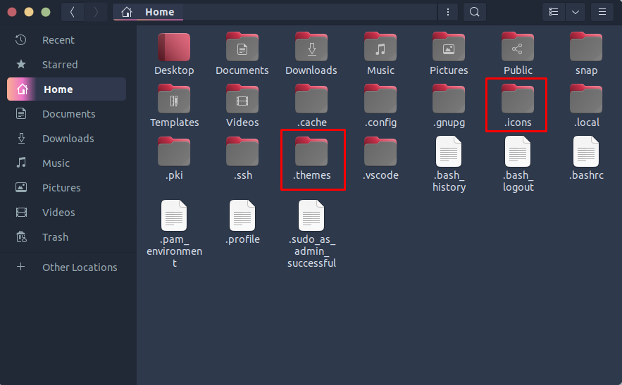

# Linux Command for First-Time Setup

## 📝 Why?
Every time I install Linux, I have to repeat the same setup steps. Sometimes I forget one and have to redo the whole process. So I created this repository to make sure every fresh install is set up correctly.

> **Tested on:** Ubuntu 26.04 LTS (Resolute Raccoon) — GNOME 50 / Wayland
> **Last updated:** September 2026

---

## 🔄 System Updates

### Update package lists
```bash
sudo apt update
```

### Upgrade installed packages
```bash
sudo apt upgrade -y
```

### Full upgrade (handles dependencies + kernel)
```bash
sudo apt full-upgrade -y
```

### Clean up
```bash
sudo apt autoremove -y
sudo apt autoclean
```

---

## 📦 Install Favorite Apps
```bash
sudo apt install obs-studio vlc gimp gparted synaptic -y
```

### Install Ubuntu Restricted Extras
```bash
sudo apt install ubuntu-restricted-extras -y
```

> **Note:** `ubuntu-restricted-extras` (version 68build1) is confirmed available in the Ubuntu 26.04 repositories.

### Improve Laptop Battery
```bash
sudo apt install tlp tlp-rdw -y
sudo systemctl enable --now tlp
```

> **Note:** The `tlp` package is still current. `tlp-rdw` is a recommended add-on for radio device control.

### Install Build Essentials & Common Tools
```bash
sudo apt install build-essential git wget curl htop neofetch -y
```

### Enable Firewall (UFW)
```bash
sudo apt install ufw -y
sudo ufw enable
sudo ufw status
```

---

## 🛠️ Install Custom Software (.deb)

```bash
sudo apt install ./path/to/package.deb
```

> **Important:** Use `apt install ./package.deb` (with `./`) instead of `dpkg -i`. This automatically handles dependencies and is the recommended method.

---

## 🎨 Install GNOME Tweaks & Extensions
```bash
sudo apt install gnome-tweaks gnome-shell-extensions gnome-shell-extension-manager -y
```

> ⚠️ **Note:** On Ubuntu 26.04 (Wayland), `Alt+F2 + r` no longer works. You must **log out and back in** for extension changes to apply.

### Taskbar app click to minimize
```bash
gsettings set org.gnome.shell.extensions.dash-to-dock click-action 'minimize'
```

> ⚠️ **Known Bug:** On Ubuntu 26.04, there is a confirmed bug where clicking a freshly launched pinned app does not minimize on the first click. You must manually minimize the window once before the dock click action works correctly. This is a known issue in the Ubuntu Dock extension.

### Show battery percentage
```bash
gsettings set org.gnome.desktop.interface show-battery-percentage true
```

### Enable tap-to-click (laptops)
```bash
gsettings set org.gnome.desktop.peripherals.touchpad tap-to-click true
```

---

## 🟢 Node.js via NVM

### Install NVM
```bash
curl -o- https://raw.githubusercontent.com/nvm-sh/nvm/v0.40.7/install.sh | bash
```

### Reload shell config
```bash
source ~/.bashrc
```

### Install Node.js
```bash
# Latest version
nvm install node

# LTS version
nvm install --lts
nvm use --lts

# Verify
node -v && npm -v
```

---

## 🎭 Install Theme
https://www.gnome-look.org/p/1619506

Create two folders in your home directory, press `Ctrl + H` to show hidden files, then create `.themes` & `.icons`:

```bash
mkdir -p ~/.themes ~/.icons ~/.local/share/fonts
```



Extract downloaded themes into `~/.themes` and icons into `~/.icons`, then apply via **GNOME Tweaks → Appearance**.

---

## 📦 Flatpak & Flathub
```bash
sudo apt install flatpak -y
flatpak remote-add --if-not-exists flathub https://flathub.org/repo/flathub.flatpakrepo
```

> Reboot required after installing Flatpak for application launchers to recognize Flatpak apps.

---

## 🐳 Docker (Official Repository Method)
```bash
# Add Docker's official GPG key
sudo apt-get update
sudo apt-get install ca-certificates curl
sudo install -m 0755 -d /etc/apt/keyrings
sudo curl -fsSL https://download.docker.com/linux/ubuntu/gpg -o /etc/apt/keyrings/docker.asc
sudo chmod a+r /etc/apt/keyrings/docker.asc

# Add the repository to Apt sources
echo \
  "deb [arch=$(dpkg --print-architecture) signed-by=/etc/apt/keyrings/docker.asc] https://download.docker.com/linux/ubuntu \
  $(. /etc/os-release && echo "${UBUNTU_CODENAME:-$VERSION_CODENAME}") stable" | \
  sudo tee /etc/apt/sources.list.d/docker.list > /dev/null
sudo apt-get update

# Install Docker packages
sudo apt-get install docker-ce docker-ce-cli containerd.io docker-buildx-plugin docker-compose-plugin -y

# Add user to docker group
sudo usermod -aG docker $USER
```

> **Note:** Log out and back in for group changes to take effect. The convenience script (`curl -fsSL https://get.docker.com | sh`) is only recommended for testing and development environments. The official repository method is preferred for production.

---

## 🔧 Additional Recommendations

| Task | Command |
|------|---------|
| Install Snap (if not present) | `sudo apt install snapd -y` |
| Enable SSH server | `sudo apt install openssh-server -y` |
| Set timezone | `sudo timedatectl set-timezone Region/City` |
| Check disk usage | `df -h` or install `ncdu` |
| Install Zsh + Oh My Zsh | `sudo apt install zsh -y && sh -c "$(curl -fsSL https://raw.githubusercontent.com/ohmyzsh/ohmyzsh/master/tools/install.sh)"` |

---
